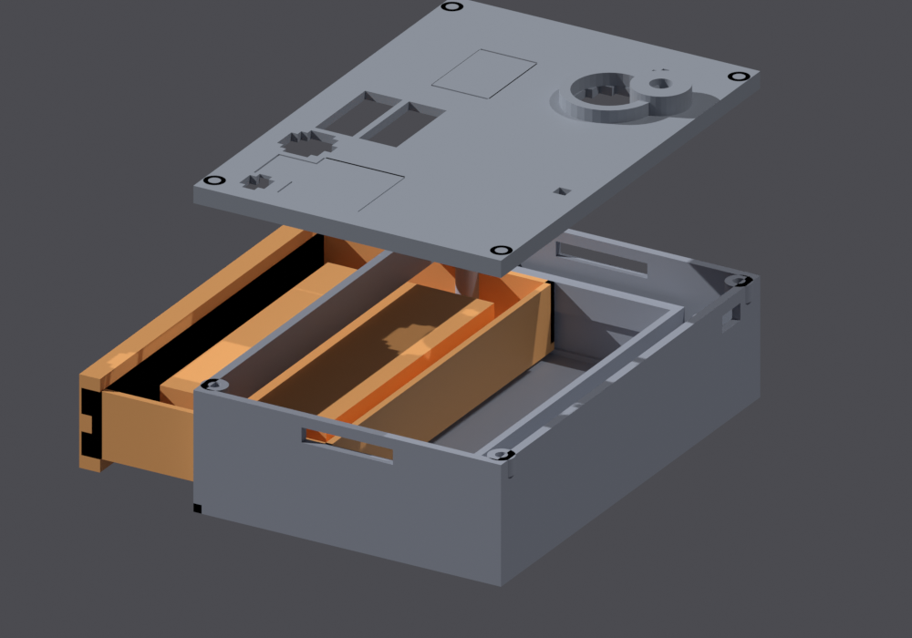

# Wapiti Trail Camera

Wapiti is an open-hardware cellular trail camera built for the harshest hunts: a 4K-capable IMX415 (8.4 MP) sensor on an SSC377Q SoC, an EG915U LTE Cat-1bis modem with GNSS and eSIM, and an ESP32-C6 wake supervisor that owns the heartbeat, PIR/radar wakeups and cold-start power sequencing. It runs through −40 °C on drawer batteries plus solar (with a sub-zero charge interlock), backed by a 5 F supercap that rides through radio bursts. A mitten-friendly hi-vis battery drawer swaps packs in seconds, dual 940/850 nm IR illuminators cover day and night, and an LD2410 mmWave radar confirms presence before the main SoC ever wakes up. Tree straps and a ¼-20 tripod boss mount it to any tree; BLE-gated on-demand Wi-Fi pulls photos straight to a phone at the camera — no LTE data, no coverage needed. Every photo and clip is encrypted at rest with per-device keys, so a stolen camera or SD card yields hardware, never your media. Every artifact in this repo — schematics, footprints, PCB, chassis and renders — regenerates from Python scripts.

  
   <em>Exploded chassis view (lid, base, battery drawer). STLs, drawings and regeneration commands in the <a href="hardware/README.md">hardware guide</a>.</em>

## Documentation

| Document | What's inside |
| --- | --- |
| [Project plan](docs/project-plan.md) | Architecture, BOM & power budget (§4), Yocto firmware plan (meta-wapiti / yocto-cam) |
| [Test plan](docs/test-plan.md) | 301 test IDs across all subsystems, incl. YOCT-01…06 firmware bring-up |
| [Competitive analysis](docs/competitive-analysis.md) | Positioning vs Tactacam Reveal and peers; −40 °C power strategy (§4.2), mitten-swap chassis (§4.13) |
| [Tactacam Reveal research report](docs/tactacam-reveal-hunt-cameras-product-research-report.md) | Product research on the market-leading cellular trail camera |
| [Hardware guide](hardware/README.md) | Schematic/PCB/chassis artifacts, regeneration commands, PCB↔chassis mapping, Value SKU (wapiti-lite) |

## Quick facts

- **Product:** cellular trail camera, 4K / 8.4 MP, radar-confirmed instant wakeups.
- **Value SKU:** **wapiti-lite** — same board with the LD2410 radar assembled DNP.
- **Connectivity:** EG915U LTE Cat-1bis + GNSS, eSIM out of the box.
- **Power:** solar input with a <0 °C charge interlock, 5 F supercap ride-through for radio bursts.
- **Enclosure:** 108 × 74 × 33 mm chassis with 0.8 mm RF-window membranes; hi-vis mitten-swap battery drawer.
- **Firmware:** Yocto Linux — `meta-wapiti` BSP + `yocto-cam` image.
- **Reproducibility:** everything regenerates from the scripts in [`hardware/`](hardware/README.md) — no manual KiCad edits.
