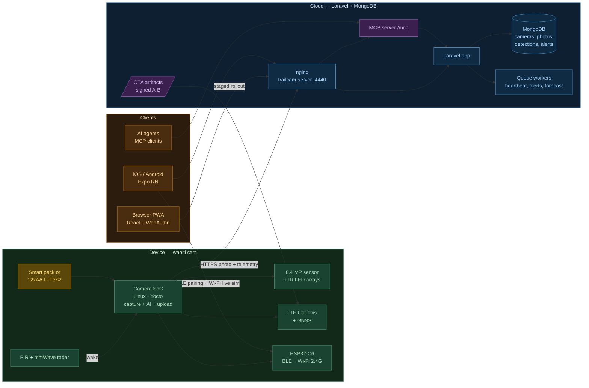
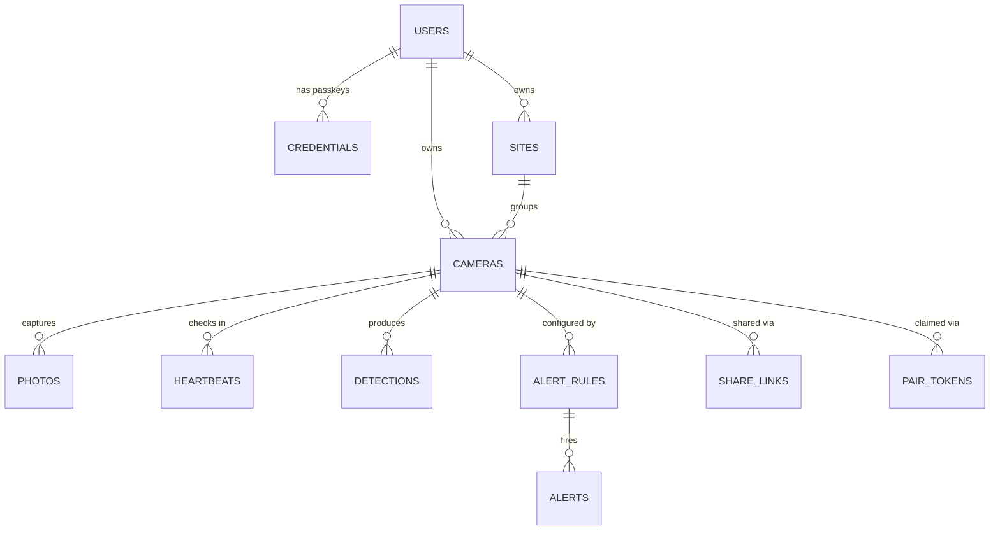
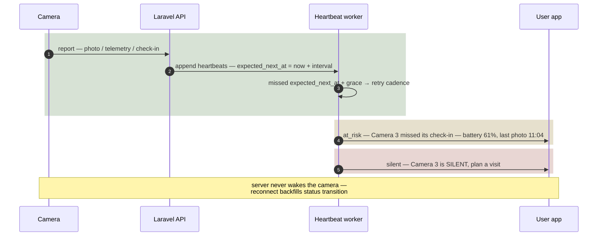
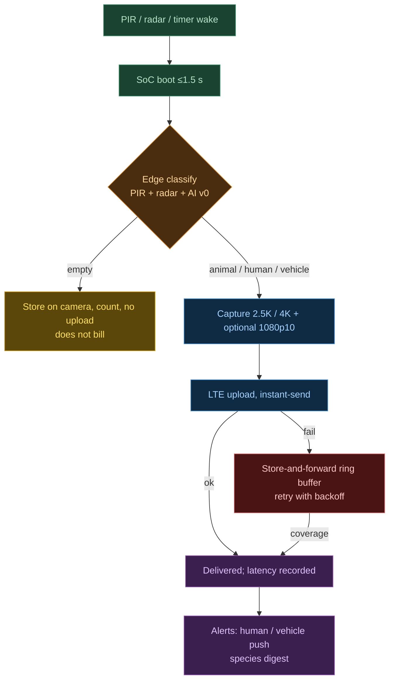
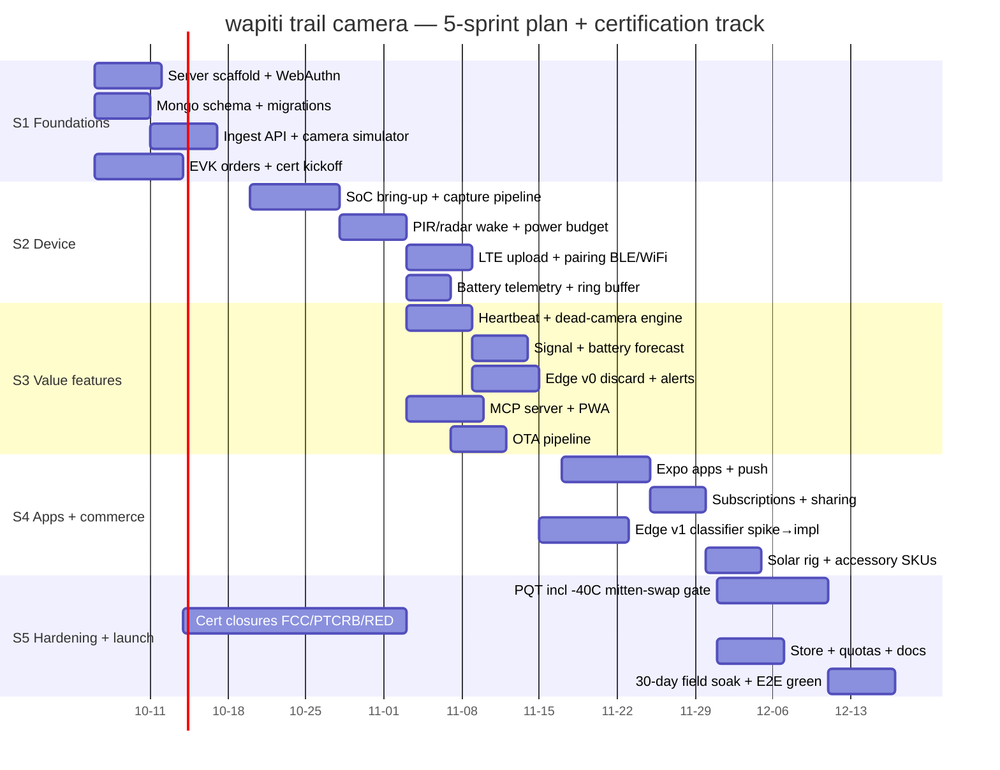

# PROJECT.md — Trail Camera

Working name: **wapiti** (repo: `trailcam`). A cellular trail camera product built around a **4K low-power camera SoC + LTE Cat-1bis + BLE/Wi-Fi co-processor**, a **−40 °C-rated, mitten-swappable power system**, a **Laravel + MongoDB** web application with **WebAuthn passkey** login, an **MCP server** exposing cameras to AI agents, and **iOS/Android apps (Expo React Native)** + PWA. The product wedge is **verifiable reliability**: heartbeat + dead-camera detection, honest battery math, delivery-latency honesty, and support as a feature (`competitive-analysis.md` §4).

Modeled on:
- The five-sprint program shape, work-item numbering, domain-model conventions, and MCP layer of **luggage-tracker** (`/repos/www/luggage-tracker/docs/project-plan.md`) — our closest sibling (battery-powered LTE device + Laravel cloud + MCP).
- The camera-hardware lessons of **wificam** (`/repos/www/wificam/docs/project-plan.md`): ESP32-CAM class hardware caps at 2 MP/OV2640 — a 4K parity product needs a real camera SoC.
- The **Yocto platform pattern** of **wificam §2.2** (`meta-wificam` product layer on a hardened substrate, SWUpdate A/B, read-only rootfs): reused here via a `meta-wapiti` layer. The Jetson substrate itself is not reusable (L4T/CUDA-specific), so the trailcam gets its own machine-agnostic `yocto-cam` substrate + BSP layer.
- The Laravel/MongoDB + nginx + WebAuthn + Docker service-group stack of **blip.io / wificam / luggage-tracker**.

**Product basis.** `tactacam-reveal-hunt-cameras-product-research-report.md` (parity spec + competitor pricing) and `competitive-analysis.md` Rev B (pain points → solutions; −40 °C power system §4.2; mitten-swap chassis §4.13).

---

## Table of Contents

1. [Goals & non-goals](#1-goals--non-goals)
2. [Competitive feature matrix — copy, match, and leapfrog](#2-competitive-feature-matrix)
3. [High-level architecture](#3-high-level-architecture)
4. [Hardware inventory & bill of materials](#4-hardware-inventory--bill-of-materials)
5. [Power architecture (−40 °C) & chassis design](#5-power-architecture--40-c--chassis-design) — incl. §5.4 BLE-gated local download
6. [Domain model & first-class objects](#6-domain-model--first-class-objects)
7. [Tiers, RBAC & sharing](#7-tiers-rbac--sharing)
8. [Data & control flows](#8-data--control-flows)
9. [Server stack (Laravel + MongoDB + nginx)](#9-server-stack)
10. [Authentication (WebAuthn)](#10-authentication-webauthn)
11. [AI & MCP layer — the differentiator](#11-ai--mcp-layer)
12. [Sprint plan (S1 → S5)](#12-sprint-plan)
13. [Certifications & compliance](#13-certifications--compliance)
14. [API surface](#14-api-surface)
15. [Security posture](#15-security-posture)
16. [Testing plan (summary)](#16-testing-plan-summary)
17. [Deployment & operations](#17-deployment--operations)
18. [Directory layout](#18-directory-layout)
19. [Risks & open questions](#19-risks--open-questions)

---

## Implementation Status

Not started; planning docs complete. Status legend: `[x]` done · `[~]` in progress · `[ ]` not started.

| Component | Status | Notes |
|---|---|---|
| Research + competitive analysis | `[x]` Done | `tactacam-reveal-…-report.md`, `competitive-analysis.md` (Rev B) |
| project-plan / test-plan | `[x]` Done | This file + `test-plan.md` |
| Device firmware (camera SoC + C6) | `[ ]` | Yocto Linux (`meta-wapiti` on `yocto-cam` substrate) + Zephyr on C6; bring-up S2 |
| Device simulator (`sim/`) | `[ ]` | Photo/report simulator for cloud work without hardware |
| Laravel scaffold + WebAuthn (AUTH) | `[ ]` | Reuse wificam/lugtrax WebAuthn contract verbatim |
| MongoDB schema + migrations | `[ ]` | 13 collections (§6) |
| nginx site + service group | `[ ]` | `trailcam-server` case, port **4440** |
| Ingest API (`/device/v1/*`) | `[ ]` | Device bearer auth, config/commands piggyback |
| Heartbeat + dead-camera engine (the wedge) | `[ ]` | S3 — firmware critical path |
| MCP server (`/mcp`) | `[ ]` | Official Laravel MCP package, S3 |
| OTA campaigns | `[ ]` | Signed A/B firmware, staged rollout |
| Mobile apps (Expo) | `[ ]` | S4; PWA ships first (S3) |
| Certification program (§13) | `[ ]` | Kick off S1 — radio lead times 6–9 months |

---

## 1. Goals & non-goals

### Goals
- **Parity or better on the 2026 spec floor** (`competitive-analysis.md` §2): 4K photos / 1080p video, simultaneous photo+video on one trigger, app-selectable no-glow (80′)/low-glow (96′) IR, multi-carrier LTE with auto-carrier selection, 8 GB internal + microSD, GPS, LCD aiming screen, QR onboarding ≤ 5 min.
- **−40 °C operation, published and tested.** Full function (boot, PIR wake, capture, upload) at −40 °C; battery forecast derates on weather. Charging interlocks below 0 °C. Nobody in the category publishes a tested minimum (§2, "Cold rating" row).
- **Mitten-swappable battery** (`competitive-analysis.md` §4.13): one-motion slide rail + full-width paddle ejection; bench gate = **one-hand gloved swap < 20 s at −40 °C**, printed on the box. Supercap ride-through preserves RTC/settings/heartbeat during swap.
- **The wedge — heartbeat + dead-camera detection:** every camera checks in on schedule (daily minimum, hourly default); a missed check-in pushes an app/email alert the same day with battery + last-photo context; camera status `healthy / at-risk / silent`.
- **Honest battery:** weather-adjusted weeks-remaining forecast in the app; instant-send trade shown live; chemistry auto-detect via smart-pack ID (NiMH warns, alkaline advises).
- **False-trigger discipline:** PIR + radar fusion and on-device AI classify (deer/turkey/human/vehicle/empty) *before* upload; empty frames never consume plan photos.
- **Honest delivery:** store-and-forward with per-camera latency status ("usually < 60 s; degraded — tower congestion"); median delivery SLA displayed in the app.
- **Honest economics:** Free-forever tier (1 check-in/day + 50 photos/mo, never bricks), one clean paid tier $7.99/mo with **all** camera features included (Live View, on-demand video, HD — no add-on ladder), pause anytime, opt-in capped overage.
- **Support as a feature:** 3-year warranty, advance replacement, published SLAs, diagnostics auto-attached to support chats.
- **AI-native:** MCP server at `/mcp` so agents can ask *"which cameras are at-risk and what walked past Camera 3 last night?"* and *act* (arm, reconfigure cadence). No trail-cam competitor ships this.
- **Accessory stability:** one connector standard; 5-year cross-generation compatibility pledge, published.

### Non-goals (v1)
- **No ESP32 as the camera.** ESP32-CAM-class silicon is 2 MP (OV2640) and cannot meet the 4K parity floor (wificam §3 lesson). ESP32-C6 is our **co-processor** (BLE + Wi-Fi), never the imager.
- **No continuous 30 FPS live streaming** (Spartan-class); Live View = Ultra-style on-demand bursts (≤ 4 min of 1080p).
- **No Wi-Fi-only or 5G SKU.** The buyer is rural; cellular is the product. 5G costs watts we don't have.
- **No megapixel marketing games.** Honest 4K (8.4 MP sensor); no "50 MP interpolated" copy.
- **No multi-brand sprawl** (defend/feeder cams); one excellent camera and one app.
- **No crowdsourced finding network, no two-way audio, no PTZ.**
- **No proprietary lock-in tricks:** no abandoned battery form factors, no carrier-locked SKUs, no features gated behind a second app.

---

## 2. Competitive feature matrix — copy, match, and leapfrog

Condensed from `competitive-analysis.md`; legend ✅ v1 · 🟡 stretch · ❌ not in v1.

| # | Feature (source) | Competitor state | Our plan | Status |
|---|---|---|---|---|
| 1 | 4K photo + 1080p video + simultaneous capture (REVEAL 4.0) | Table stakes | 8.4 MP sensor, real 4K stills + 1080p60, photo+video one trigger | ✅ |
| 2 | App-selectable no-glow/low-glow IR (Pro/Ultra) | Pro-tier only | Both LED arrays, switchable in app | ✅ |
| 3 | Multi-carrier LTE, auto-select (all majors) | Standard | Cat-1bis module, multi-IMSI eSIM bundled, no carrier lock | ✅ |
| 4 | Built-in GPS + move alert (X 4.0/Ultra) | Standard; reserve-battery GPS = Ultra only | GNSS + move alert; **reserve-battery anti-theft GPS** (½-mile trigger, 6 h pings after power loss) | ✅ |
| 5 | Modular power (FlexPack R5/R10) | Tactacam-only, cartridge reset per generation | Smart pack + AA tray + solar, one connector, 5-yr pledge | ✅ |
| 6 | Tested cold rating | **Nobody publishes one** (users ask for −20 °C) | **−40 °C tested, published on box** | ✅ |
| 7 | Glove-operable swap | Nobody designs for it (zip-tie stories) | Paddle-lever slide rail; < 20 s gloved swap gate | ✅ |
| 8 | Heartbeat / dead-camera alert | Nobody (manual "last connection date" policing) | **Our headline feature** | ✅ |
| 9 | Weather-adjusted battery forecast | Nobody (trailcampro publishes lab data, vendors don't) | Forecast + chemistry auto-detect | ✅ |
| 10 | Delivery-latency honesty | Nobody | Per-camera latency status + store-and-forward | ✅ |
| 11 | On-device AI discard of false triggers | Cloud-only filters (Moultrie/Spypoint "Buck Tracker") | Edge classify before upload; empties don't bill | 🟡 (rules S3, ML S4) |
| 12 | Free tier | Spypoint only (100 photos) | Free-forever: 1 check-in/day + 50 photos/mo | ✅ |
| 13 | All-features-included plan | Nobody (Tactacam: 3 tiers + 2 add-ons + Live View fee) | One $7.99 tier, everything on | ✅ |
| 14 | 3-year warranty + advance replacement | Category floor is 1 year | On the box; loaner program for outfitters | ✅ |
| 15 | Signal diagnostics (RSRP, towers, latency) | Nobody (weather shows the *phone's* location) | Diagnostics page + placement coach | ✅ |
| 16 | Replaceable antenna | Nobody (Trailcampro: "about impossible") | SMA external | ✅ |
| 17 | MCP / AI-agent access | Fleet SaaS only, no trail cam | First-class `/mcp` | ✅ |
| 18 | Live video streaming (Ultra 4-min, Spartan 30 FPS) | Pro-tier features | On-demand 1080p bursts ≤ 4 min in base plan | ✅ |
| 19 | Compliance map / public-land mode | Nobody | Legal-layer roadmap item | 🟡 (S6) |
| 20 | Solar SKU (Folding Solar $99.99, Edge 4 built-in) | Standard accessory | 7 W folding panel + charge-temp interlock | ✅ |
| 21 | Crowdsourced/AirTag-style finding | Out of category | — | ❌ |
| 22 | 5G / continuous streaming | Spartan-class | Bandwidth/battery-hostile | ❌ |
| 23 | **Local download to a nearby phone (BLE-gated on-demand AP)** | **Nobody** — media path is LTE-only or card-pull | §5.4: on-demand session, per-session WPA2 key, works with zero coverage, doesn't touch plan data | 🟡 (S4) |
| 24 | **Encrypted-at-rest media (stolen camera ≠ stolen photos)** | **Nobody** — any $12 card reader reads every competitor card | §15.1: per-device AES-256 at rest (eMMC + microSD), theft-revocable keys, paired phone decrypts offline | 🟡 (S3/S4) |

**One-line strategy** (from `competitive-analysis.md`): *everyone sells cameras; nobody sells reliability you can verify — heartbeat, honest battery, −40 °C, mitten swap, one clean plan, 3-year warranty.*

---

## 3. High-level architecture



*Color key: green = device plane · yellow = power · blue = cloud · purple = security surfaces (MCP, OTA) · amber = clients.*

Three planes, lugtrax conventions:
- **Device → cloud:** HTTPS POST of photos + telemetry on PIR trigger, schedule, or check-in; modem in PSM between events; no persistent socket. **The server never wakes the camera** — commands piggyback on the next report response; SMS reserved for urgent anti-theft.
- **Cloud → device:** config deltas, command acks, OTA manifests on report responses; staged OTA pulls.
- **Clients → cloud:** PWA/App via HTTPS sessions (WebAuthn); agents via MCP (streamable HTTP, scoped API keys).

### 3.1 Containerized builds (no compilation on the host)

| Container | Image | Ports | Purpose |
|---|---|---|---|
| `trailcam-server` | `nginx:v5` | **4440** | Laravel + nginx + MCP |
| `trailcam-builder` | `trailcam-builder:v1` | — | One-shot builds; Yocto image build in CI (kas/bitbake → `wapiti-image.swu`) + Zephyr SDK for the C6 |
| `trailcam-test` | `trailcam-test:v1` | — | One-shot Python API suite |
| `trailcam-sim` | `trailcam-sim:v1` | — | Fleet of simulated cameras posting photos/telemetry (test only) |

---

## 4. Hardware inventory & bill of materials

### 4.1 Compute / imaging decision

| Option | Verdict | Why |
|---|---|---|
| **SigmaStar SSC377Q + Sony IMX415 (8.4 MP)** | **Chosen** | 4K@30 H.265 encode, ISP with strong low-light, sub-second wake-to-capture, industry-standard in battery 4K cams; Linux via **Yocto** (`meta-wapiti` on the house platform pattern — §19 R9 covers the vendor-BSP wrap); ~$6–8 SoC + ~$9–12 sensor |
| Ingenic T41 + IMX415 | Alternate | Comparable; Ingenic night ISP is excellent; second-source candidate — **design the carrier so either drops in** |
| Ambarella CV25/S6LM | Rejected v1 | Best AI-ISP class but ~$25–40 and long lead; overkill for v1 edge AI (radar+PIR rules first) |
| ESP32-S3 + OV5640 | **Rejected** | 2 MP-class ceiling — fails 4K parity (wificam evidence); keep ESP32 as co-processor only |

### 4.2 BOM (target ≤ $65 @ 10k units)

| Item | Model / spec | Qty | Est. @10k | Notes |
|---|---|---|---|---|
| Camera SoC | SigmaStar SSC377Q (Ingenic T41 second source) | 1 | $7 | Linux, H.265, fast boot |
| Image sensor | Sony IMX415 (8.4 MP, 4K30, STARVIS low-light) | 1 | $11 | Real 4K (3840×2160) |
| Lens | 6 mm F1.6 IR-corrected, dual IR-cut filter switch | 1 | $3.5 | Day/night true color |
| IR illumination | 940 nm no-glow array (80′) + 850 nm low-glow array (96′), independently switched | 2 | $2.5 | App-selectable = parity + §2 row 2 |
| PIR + Fresnel | AS312-class digital PIR, dual element | 1 | $0.9 | Wake source |
| mmWave radar | 24 GHz motion radar (LD2410-class), optional populate | 1 | $3 | PIR+radar fusion kills false triggers (P5); DNP on cost-down SKUs |
| Co-processor | ESP32-C6 (BLE 5 + Wi-Fi 6 2.4 GHz) | 1 | $2 | BLE pairing, Wi-Fi live-aim/preview, AP-scan diagnostics, watchdog |
| Cellular | Quectel **EG915U** LTE Cat-1bis **+ GNSS combo** (or SimCom A7672SA) | 1 | $11 | Photo-class uplink (5 M UL) vs LTE-M's 375 k; multi-carrier; GNSS on-module saves BOM |
| eSIM | Multi-IMSI consumer eSIM, carrier profiles staged by us | 1 | $2 | Bundled connectivity (lugtrax §6.1.1 pattern) |
| Accel | LIS2DW12 ultra-low-power 3-axis | 1 | $1 | Move alert / theft GPS trigger |
| Fuel gauge + pack ID | BQ27441-class gauge; SHT3x temp/humidity; pack-ID EEPROM | 1 | $2 | Smart-pack telemetry, chemistry auto-detect |
| RTC + supercaps | Low-power RTC + supercap ride-through bank | 1 | $2.5 | Swap without losing time/settings/heartbeat |
| Storage | 8 GB eMMC + microSD slot (UHS-I, no U3-only quirk) | 1 | $4.5 | Internal-first, SD optional |
| PMIC / power tree | Buck/boost, camera rail switches, solar input with **< 0 °C charge interlock** | 1 | $4 | §5 |
| Reserve battery | Small Li primary cell on secondary rail (GPS + RTC only) | 1 | $1.5 | Ultra-style anti-theft ping after main power loss |
| PCB + passives | 4-layer main board + antenna keep-outs | 1 | $8 | SMA antenna connector (§2 row 16) |
| Enclosure | IP67 ABS-PC + TPE overmold, gasket, slide-rail bay, paddle latch, insulated battery bay, hi-vis interior | 1 | $9 | §5 chassis spec |
| Display | 2.0″ side-facing LCD (aim/preview) | 1 | $4 | Parity row |
| Assembly/test/pack | ICT + calibration + box | — | $8 | QR onboarding card, strap, mount |

**BOM ≈ $62–65 @ 10k** → supports **$149 camera** retail; **$199 solar bundle** (camera + 7 W folding panel + standard pack). Accessories: smart pack $49 (5 Ah NMC), Arctic pack $89 (LTO), AA tray $19, security box $29, tree mount $19.

### 4.3 Bench/dev hardware

| Item | Qty | Purpose |
|---|---|---|
| SSC377Q + IMX415 EVK, EG915U EVB, ESP32-C6 devkit | 1 ea | Firmware bring-up before PCBs |
| Cold chamber (or rental slot) + mitten rig | 1 | §5/§13 gates; PQT-COLD suite |
| Power analyzer (µA-class, e.g. Otii/Joulescope) | 1 | Power-budget validation (PWR suite) |
| PIR/radar test rig + range course | 1 | PIR false-trigger regression |

---

## 5. Power architecture (−40 °C) & chassis design

Grounded in `competitive-analysis.md` §4.2/§4.13 (hard requirement: **−40 °C operation; mitten-operable swap**).

### 5.1 Power family

| Option | Role | −40 °C behavior | Notes |
|---|---|---|---|
| **12×AA tray, Li-FeS₂ primary** | Universal fallback, zero-charger | Natively **−40 °C**, 10-yr shelf | Guaranteed-cold path; Trailcampro's 6.8-month basis |
| **Smart pack — standard (low-temp NMC 5 Ah)** | Primary ecosystem pack | Discharge to **−40 °C** (published ~60–70% derate); **charge-locked < 0 °C** with in-app advisory | Fuel-gauge + pack-ID on-pack; USB-C on the pack (camera stays sealed); solar interlock |
| **Smart pack — Arctic (LTO)** | Outfitters / far-north / always-solar | Charges −30 °C, discharges −40 °C flat, 10k+ cycles | ~2× weight for same Wh — sold as a choice |
| NiMH AA | Supported, warned | Voltage sag → early shutoff | Pack-ID/profile derates forecast + warns |
| Alkaline | Discouraged | Cold cliff + leak risk | Advisory on install |
| Sealed built-in · LiFePO₄ · LiSoCl₂ main | Rejected | — | Disposable camera; cold-charge limits; venting |

### 5.2 Power budget (targets, validated by PWR suite)

| State | Target |
|---|---|
| Sleep (PIR + RTC + accel armed) | ≤ 120 µA average |
| Wake-to-capture | ≤ 1.5 s (suspend-to-RAM resume; cold boot is not the hot path) |
| Energy per standard cycle (capture 2.5K JPEG + telemetry + upload) | ≤ 1.1 Wh |
| Energy per 4K cycle (4K still + 1080p10 clip + upload) | ≤ 2.2 Wh |
| Runtime on 12×AA Li-FeS₂ (54 Wh) | ≥ 6 months @ 30 photos/day hybrid; instant-send trade shown in app |
| Runtime on standard 5 Ah pack | ≥ 4 months same profile; solar rig = indefinite |

Heavy-usage planning (per-event Ah, profile table, chemistry prices, Blink/Energizer field findings) lives in `competitive-analysis.md` §4.2; **BAT-01..06 field trials** (test-plan §21.6) replace those estimates with measured burn-down once prototypes run.

### 5.3 Chassis spec (the §4.13 hardware wedge)

- **One-motion slide rail, gravity-assisted:** chamfered lead-in rails, positive click on insert; ejection = **full-width paddle lever** pushable with mitten palm/elbow/numb fingers. No pinch-tabs, no screws, no door-fully-open extraction.
- **Glove geometry:** ≥ 20 mm finger clearance, full-width recessed pull tab, TPE overmold. **Bench gate before design freeze: one-hand gloved swap < 20 s at −40 °C.**
- **Anti-ice:** silicone gasket (won't freeze shut), drip channel, latch breaks ice seal on open, frost-proof chamfered rails, hi-vis orange interior + tactile ridges.
- **Swap survival:** supercap ride-through keeps RTC/settings/heartbeat alive across the ~25 mm slide-out.
- **Spec'd, not hoped:** 500-cycle cold-chamber latch test at −40 °C with simulated mittens; Moultrie's zip-tie story never happens here.
- **Serviceability:** SMA antenna, security-box + python-lock provisions, tree mount ¼-20 + strap.
- **Tree mount as shipped (Rev C):** two strap slots in both side walls (2 in webbing wraps the tree vertically; slot lips carry the load) + a 1/4-20 UNC tripod boss on the lid. Pull/torque evidence: **PQT-08**. Geometry in `hardware/chassis/gen_chassis_stl.py`; see `hardware/README.md` → "Tree mount".
- **Local media download — BLE-gated on-demand AP mode (Rev C, §5.4):** pull 4K photos/clips straight to a phone at the camera — no LTE data, no subscription metering. Detailed plan below.

### 5.4 Local media download — BLE-gated on-demand AP mode

The C6 already carries Wi-Fi 6 for pairing and live-aim; this feature reuses it as a **secure, on-demand file bridge** so a user standing at the camera can pull full-resolution media to their phone in minutes — no LTE data burned, no plan photos consumed, works with zero cellular coverage (deep-canyon sites, plane mode for the flight home).

**Why AP mode, and why it is safe here.** Project posture says "no LAN services on the camera" (§15). AP mode does not violate that if the network **exists only on demand**: never advertises by default, requires BLE proximity to enable, shuts down automatically, and serves one authenticated purpose. The attack surface is a radio that is off 99.9 % of the time and is gated by physical presence.

**Flow (mirrors §8.3 pairing):**
1. User opens the app at the camera → **"Download media"** → app scans BLE → C6 advertises `WAPITI-DL-<device_id>` only while the session window is open.
2. App ↔ C6 BLE handshake: session token `DLT-xxxx-xxxx` (10 min TTL, single use) + media filter request (`from/until/class`).
3. C6 instructs the SoC to start the download service, then enables the AP: SSID derived per session (`wapiti-dl-<short-id>`), **WPA2-PSK key generated per session** (delivered over the encrypted BLE channel — never displayed, never static).
4. Phone joins the AP; the app talks HTTPS to `https://192.168.77.1` with the session token (device-local TLS: the SoC's self-signed cert is pinned via the session token transcript — MITM-safe without a CA).
5. Media streams via `/device/v1/local/media` manifest + chunked range GETs from eMMC/microSD; thumbnails first, then full res on demand.
6. Session ends on completion, user cancel, BLE disconnect + 60 s, or **hard 10-minute cap** — whichever comes first. AP off, service off, radio back to PSM.

**Security gates (all mandatory):** BLE gate (session only creatable over authenticated BLE, which requires the pairing bond from §8.3) · per-session SSID + WPA2 key · TLS with token-pinned self-signed cert · scope = media only (no config writes, no cloud creds on that service) · audit row `local_download` written and synced with the next check-in · rate limit 1 session / 5 min · AP never starts outside a session.

**Power profile:** the C6 AP + SoC file service cost ≈ 1.5–2.5 W for the session; a 5 Ah pack sustains ~10 h of aggregate session time per month — budgeted as `local_dl_s` telemetry and shown honestly in the battery forecast (PWR family).

**Range reality (honesty is the brand):** 2.4 GHz on a sealed box ≈ 15–30 m line-of-sight — this is a "standing next to the camera" feature, not a village-wide file server. Use it at the truck or at the tree.

**Implementation slices:**
- C6 (Zephyr): `dl_session` service — BLE characteristic pair, AP bring-up/teardown, watchdog enforce (hard cap regardless of host state).
- SoC (Yocto): `wapiti-local-dl` systemd socket service — TLS listener on 192.168.77.1:443 (fixed service subnet, never routes to LTE), manifest + range GET handlers, eMMC/SD file access through the normal media store, audit + telemetry emission.
- App: BLE-proximity entry point, progress UI, photo picker filter, post-download gallery import.
- Server: ingest `local_download` audit events + telemetry field; no other cloud dependency (feature works fully offline).

- **Encryption interplay:** the AP serves media as ciphertext only; the paired phone decrypts locally with the cached per-device media key (§15.1) — zero-coverage decrypt works because the phone holds the key, not because the camera exposes one.

**Verification:** `LDL-01..12` in `test-plan.md` §11bis; security review item in §15 checklist; battery accounting covered by PWR telemetry tests.

---

## 6. Domain model & first-class objects

MongoDB, collection per class, ObjectId refs (house convention).



### 6.1 Collections

**`users`** — `{_id, handle, email, role: admin|user, tier: free|pro|outfitter, push_tokens[], created_at, last_seen_at}`

**`credentials`** — WebAuthn; verbatim wificam/lugtrax shape (`credential_id, public_key, sign_count, aaguid, nickname, transports, timestamps`).

**`sites`** (the property/hunting land — lugtrax "item" analog)
| Field | Type | Notes |
|---|---|---|
| `_id, owner_id` | ObjectId | |
| `name` | string | "North 40" |
| `location` | `{lat, lon}` | Weather lookup anchor (battery forecast, forecast derates) |
| `notes` | string | Markdown |

**`cameras`** (the device)
| Field | Type | Notes |
|---|---|---|
| `_id, owner_id, site_id?` | ObjectId | |
| `device_id` | string | Factory-provisioned, QR-printed, immutable |
| `claimed_at` | datetime? | Null = stock |
| `fw_version / hw_version` | string | Every report |
| `power` | object | `{source: aa_tray|smart_pack|arctic_pack, chemistry, gauge_pct, voltage_mv, temp_c, forecast_days, pack_id}` |
| `signal` | object | `{rsrp_dbm, rsrq_dbm, band, carrier, latency_ms_p50, last_towers[]}` |
| `mode` | enum | `normal | theft | suspended` |
| `status` | enum | `healthy | at_risk | silent` — **the wedge state** |
| `capture_config` | object | `{photo_res: 4k|2.5k, video: off|1080p10, simultaneous: bool, ir: no_glow|low_glow|auto, interval_s, quiet_hours, instant_send: bool}` |
| `last_seen_at / last_photo_at` | datetime | |
| `created_at` | datetime | |

**`photos`** — `{_id, camera_id, owner_id, site_id, kind: photo|video|live_burst, res, bytes, storage_key, thumb_key, ai_class, ai_confidence, transmitted: bool, capture_at, created_at}` (indexed `{owner_id, capture_at}`, `{camera_id, capture_at}`)

**`detections`** — `{_id, camera_id, owner_id, class: deer|turkey|human|vehicle|empty|other, confidence, photo_id, on_device_decided: bool, billed: bool, capture_at}` — `empty` rows keep the audit trail without billing.

**`heartbeats`** — `{_id, camera_id, at, battery_snapshot, signal_snapshot, expected_next_at, transport}` — TTL-indexed rolling window; the engine evaluates `status`.

**`pair_tokens`** — `{token: PRT-xxxx-xxxx, device_id, issued_by, expires_at (15 min, TTL), consumed_at}`.

**`alert_rules` / `alerts`** — rules: `{camera_id, class: silent|battery_low|move_alert|human|vehicle|delivery_slow, min_confidence, quiet_hours, channels[]}`; alerts: `{rule_id, camera_id, payload, notified, created_at}` — SSE feed `/api/alerts/stream`.

**`share_links`** — `{token, camera_id, scope: live|recent_24h, expires_at (≤ 7 d), revoked_at, created_by}` — public staff-viewer page, rate-limited, audited (lugtrax partner-mode pattern).

**`subscriptions`, `ota_campaigns`, `audit_log`** — lugtrax §5.10 shapes verbatim.

---

## 7. Tiers, RBAC & sharing

### 7.1 Plans (published, no contracts; connectivity bundled)

| Tier | Cameras | Check-in floor | Photos/mo | History | Members | Price |
|---|---|---|---|---|---|---|
| **Free** | 1 | 1/day | 50 | 7 days | 1 | **$0 forever** |
| **Pro** | 10 | 1/hour | Unlimited | 1 year | 5 | **$7.99/mo** ($79/yr) — **all camera features included** |
| **Outfitter** | 50 | 1/hour | Unlimited | 2 years | Unlimited + API + MCP | **$24.99/mo** |

- **No add-on ladder:** Live View, on-demand video, HD requests, species filters — all in Pro (anti-Tactacam posture; `competitive-analysis.md` §4.3).
- **Pause anytime** in-app (offseason = $0); **opt-in capped overage only**; lapsed → Free tier (never a brick).
- Hardware: **$149** camera; **$199** solar bundle; packs $49/$89.

### 7.2 RBAC

| Role | Rights |
|---|---|
| **admin** | Users, tiers, OTA campaigns, settings |
| **owner** | Full camera control (config, theft arm, sharing, delete) |
| **member** | Live view + history per site; cannot arm/config |
| **link** | Anonymous share-link: scoped, expiring, read-only |

---

## 8. Data & control flows

### 8.1 Heartbeat + dead-camera detection (the wedge)



*Color key: green = ingest path · amber = at-risk push · red = silent-death push.*

### 8.2 Capture → classify → deliver



### 8.3 Pairing (lugtrax §7.2 pattern, BLE via C6)

Scan QR → app scans BLE → `PRT-xxxx-xxxx` pair token (15 min) → camera posts `/device/v1/pair` with factory secret → `device_token` issued → Wi-Fi credentials optionally handed to C6 for live-aim/preview at setup.

### 8.4 Theft mode + anti-theft GPS

Move-alert (accel) or human/vehicle detection arms theft mode (auto-rule or manual/MCP): burst telemetry + photos at 3–10 s cadence, GPS breadcrumbs, reserve-battery pings every 6 h after main power loss/removal (½-mile trigger), SMS fallback for urgent commands, audit-logged arm/disarm. Media captured before the theft stays unreadable to whoever takes it — per-device encryption at rest with theft-revocable keys (§15.1).

### 8.5 OTA

Signed A/B firmware (ECDSA P-256), staged `canary → 10% → 100%`, boot-failure rollback counters; `rollback_of` audit linkage. Camera SoC (Linux rootfs) and C6 firmware are separate artifacts.

### 8.6 Cellular link discipline — retries, idempotency, fleet protection

Method note distilled from `interview-questions/interview_cellular_retries_qa.md` (cellular retry-engineering briefing): software must behave correctly when the radio lies — tower handoffs eat acks, coverage holes are normal, and a naive retry loop that works in the lab hammers the backend in the field and burns the pack.

**Per-class retry policy** (configurable, never a fixed count):

| Message class | Attempts | Backoff | Deadline / budget |
|---|---|---|---|
| Photo/telemetry upload (trigger-driven) | 6 | `min(cap 120 s, base 2 s · 2^n)` + **full jitter** (`random(0, window)`) | then store-and-forward (§8.2) |
| Heartbeat check-in | 3 | base 30 s, cap 10 min, full jitter | miss → HB engine handles (§8.1) |
| OTA pull | 5 | base 60 s, cap 1 h | battery-gated: abort below 20% (BMS rule) |
| SMS fallback | 1 | — | never retried (cost); next report carries state |

- **Transient vs permanent:** retry 5xx, timeouts, connection resets; **never retry 4xx** (400/401/422 will never succeed — retrying burns battery and poisons metrics).
- **Idempotency:** every device POST carries a stable `Idempotency-Key` (UUID per report / photo batch, persisted before first TX). At-least-once delivery over the radio is the only realistic default; exactly-once *effects* come from ingest-side dedup (unique index → replay original response). A lost ack in a tower handoff must never produce a duplicate photo row or double-counted heartbeat.
- **Outbox durability:** the §8.2 ring buffer is an outbox — rows written to eMMC before TX, marked synced only on server ack, drained in order after reboot. Work never lives only in RAM; the OS will not be alive when the network returns.
- **Modem circuit breaker:** N consecutive transport failures → modem cooldown (PSM until next scheduled wake). The battery is the breaker: no self-imposed TX storms.
- **Signal gating:** read RSRP/SINR before deciding *now vs defer*. Collapsing signal → defer to next wake, never accelerate. Retrying while the modem is between RRC states forces an expensive ACTIVE transition — "should I even send this now" is a modem-state question.
- **Fleet retry budget:** ingest caps fleet-wide retries (~10% of request volume); over budget → `429` + jittered `Retry-After`, which clients honor. A degraded backend stops being amplified by the fleet.
- **Staggered reconnect:** after a long outage, reconnect windows are spread over several minutes, seeded by `device_id` (server directive piggybacked on reports). Devices that all lost service at 02:00 must not all return at 02:01.
- **Instrumentation:** DNS failures counted separately from TCP failures (resolver faults masquerade as network down); correlation IDs + client/server timestamps on every attempt; modem state, RSRP and RTT captured **at failure time**, not just in aggregates.

---

## 9. Server stack

| Layer | Tech | Notes |
|---|---|---|
| Reverse proxy | nginx (`nginx:v5`) | `trailcam-server` case, host port **4440** |
| App | Laravel 12 (PHP 8.5-fpm) | House stack |
| DB | MongoDB (shared `database-server`, db `wapiti`) | 13 collections |
| Cache/queue | Redis (predis) | SSE fanout, queues, rate limits |
| AuthN | `web-auth/webauthn-lib` | Contract reused verbatim |
| MCP | Official Laravel MCP package at `/mcp` | §11 |
| Push | VAPID web push; FCM/APNs via Expo | |
| SMS | Provider HTTP API (theft urgent path) | |
| Object storage | Local `objects/` v1 → S3-compatible later | Photos, thumbs |
| Frontend | React + Bootstrap 5 PWA | House style |

nginx site `default.wapiti.cam`: `/api/`, `/auth/`, `/device/`, `/admin/api/`, `/mcp` → Laravel :8003; `client_max_body_size 25M` (4K photos + video bursts); block `.env`, `storage/`, `vendor/`.

---

## 10. Authentication (WebAuthn)

- The proven 10-endpoint contract from wificam/lugtrax (`register/begin|complete`, `add-passkey/*`, `login/begin|complete`, `logout`, `status`, `DELETE /auth/passkeys/{id}`, `POST /auth/recovery`).
- RP_ID per environment (`wapiti.cam` prod, `localhost` dev); never from Host header.
- Admin bootstrap: `php artisan wapiti:bootstrap-admin` (one-time enrollment URL).
- **Device auth separate:** per-camera `device_token` (32-byte random, rotate-able, hashed) as Bearer on `/device/v1/*`; SMS ingest authenticated by SMSC origin checks.

---

## 11. AI & MCP layer — the differentiator

### 11.1 MCP server (S3)

| Tool | Input | Effect |
|---|---|---|
| `list_cameras` | site_id? | Cameras + status (`healthy/at_risk/silent`) + battery + signal |
| `get_camera` | camera_id | Config, power forecast, last photos |
| `get_photos` | camera_id, from, to, class? | Filtered detections/photos |
| `get_status` | camera_id | Heartbeat state, latency, forecast, signal diagnostics |
| `set_capture_config` | camera_id, config | Tier-checked config update |
| `arm_theft` / `disarm_theft` | camera_id | High-risk: `theft:write` scope, audited, rate-limited |
| `get_alerts` | camera_id?, since | Recent alerts |
| `set_ir_mode` | camera_id, no_glow\|low_glow | Remote stealth switch |

Non-negotiables (lugtrax §10.1.1 hardened list): session cookies rejected at `/mcp`; revoked keys fail clean JSON-RPC; no scope minting; no LLM recursion; every call audited with secrets redacted; row caps enforced.

### 11.2 Edge + backend intelligence

- **Edge v0 (S3):** PIR + radar fusion rules + simple frame heuristics (empty-frame discard, day/night exposure sanity) — no billing on empties.
- **Edge v1 (S4):** lightweight NN classifier (deer/turkey/human/vehicle/empty) on SoC NPU — feasibility spike first (`competitive-analysis.md` §7 #7).
- **Backend (S4):** per-site species/activity digests; battery-forecast model (usage × weather); delivery-latency baselines per camera.

---

## 12. Sprint plan (S1 → S5)

2-week sprints, ~10 weeks + buffer; certification (§13) parallel 6–9 months, submissions start S1/S2.



| Sprint | Must satisfy test IDs |
|---|---|
| S1 — Foundations | `AUTH-01..18`, `SRV/SVC/PHP/MIG/BLD`, `SIM-01..06`, `ING-01..10` |
| S2 — Device | `CAM-DEV-01..14`, `YOCT-01..03`, `PIR-01..04`, `PWR-01..05`, `NET-01..05`, `PR-01..08` |
| S3 — Value | `HB-01..08`, `YOCT-04..06`, `PIR-05..08`, `PWR-06..10`, `NET-06..14`, `IMG-01..08`, `ALR-01..10`, `MCP-01..20`, `OTA-01..08`, `BROWSER-01..04`, `ENC-01..08` |
| S4 — Apps + commerce | `SUB-01..08`, `SHR-01..06`, `ADM-01..08`, E2E chains |
| S5 — Hardening | `COLD-01..08`, `PQT-01..14`, `GAP-01..20`, `BAT-01..06`, `NET-15..18`, full E2E, security review |

### Work items

**S1 — Foundations (WI-101 → WI-107)** `[ ]`
- **WI-101** Laravel + WebAuthn scaffold (reuse contract; Pest `AUTH-01..18`).
- **WI-102** Mongo schema + migrations (13 collections, indexes; `MIG-01..05`).
- **WI-103** nginx site + service group (:4440; builder/test/sim one-shots; `SVC-01..04`).
- **WI-104** Device ingest API (`/device/v1/*`): bearer auth, photo multipart, config piggyback, rate limits (`ING-01..10`).
- **WI-105** Camera simulator: N cameras, cadence/offline/latency/photo-inject profiles (`SIM-01..06`).
- **WI-106** Procurement + cert kickoff: SoC/sensor/modem EVKs, cold-chamber slot, PTCRB lab, Bluetooth SIG QDL, UN 38.3 booking.
- **WI-107** IP gate: external **FTO search on the reserve-battery GPS** (§13.1) commissioned, 1-day internal prior-art skim of §5.4 AP download, §4.11 wording discipline (capability, not competitor implementation); findings due before the S2-exit decision gate.

**S2 — Device (WI-201 → WI-206)** `[ ]`
- **WI-201** SSC377Q bring-up: Yocto BSP layer (`meta-sigmastar` wrapping the vendor kernel/u-boot/ISP blobs), sensor driver, ISP tuning baseline; first 4K still on bench; `YOCT-01..03` green.
- **WI-202** Capture pipeline: photo+video simultaneous, IR array switching, LCD aim preview, microSD.
- **WI-203** Wake chain: PIR + radar fusion, ≤ 1.5 s wake-to-capture, µA sleep budget (power analyzer evidence).
- **WI-204** LTE: EG915U bring-up, multi-IMSI eSIM attach, instant-send upload, PSM between events (`NET-01..10`).
- **WI-205** C6 co-processor: BLE pairing, Wi-Fi live aim, AP-scan diagnostics, watchdog.
- **WI-206** Power telemetry: fuel gauge, pack-ID detect, temp sensors, ring buffer + store-and-forward.

**S3 — Value features (WI-301 → WI-308)** `[ ]`
- **WI-301** Heartbeat + dead-camera engine: expected-next tracking, grace/retry, status transitions, push+email (`HB-01..08`) — **the wedge, firmware critical path**.
- **WI-302** Battery forecast service (weather-adjusted) + signal diagnostics page (`PWR-09..10`, `IMG-07..08`).
- **WI-303** Edge v0 discard + alert rules + SSE (`PIR-05..08`, `ALR-01..10`).
- **WI-304** MCP server (8 tools, auth, audit; `MCP-01..20`).
- **WI-305** PWA (gallery, live status grid, settings, WebAuthn; `BROWSER-01..04`).
- **WI-306** OTA pipeline (signed A/B for SoC rootfs + C6 fw; `OTA-01..08`).
- **WI-307** Theft mode + reserve-battery GPS + SMS fallback.
- **WI-308** Encrypted-at-rest media: per-device KEK (C6 eFuse wrap), fscrypt media store (eMMC + microSD), cloud escrow with WebAuthn-gated release, phone keystore cache, theft-revocation hook (§15.1; `ENC-01..08`).

**S4 — Apps + commerce (WI-401 → WI-405)** `[ ]`
- **WI-401** Expo apps + push (BLE proximity + setup flow; UWB-free parity) + **local-download UI (§5.4, `LDL-01..12`)**.
- **WI-402** Subscriptions + tier enforcement + pause/caps (`SUB-01..08`).
- **WI-403** Share links + member RBAC (`SHR-01..06`).
- **WI-404** Edge v1 classifier (feasibility → train → deploy; `IMG-05..06`).
- **WI-405** Solar rig + accessory SKUs + packaging (compatibility pledge printed).

**S5 — Hardening + launch (WI-501 → WI-506)** `[ ]`
- **WI-501** PQT at lab: `PQT-01..14` **including COLD-05 (gloved swap < 20 s @ −40 °C) and COLD-06 (500-cycle latch)**.
- **WI-502** Certification closures (§13).
- **WI-503** Store, quotas, GDPR export/erase, docs.
- **WI-504** 30-day field soak, 20 cameras mixed sites; burn-down vs forecast ±15%; carries the **BAT-01..06 battery trials** (incl. heavy-usage profile) and files measured Ah/day into the test-plan §21.6 results log.
- **WI-505** Security review (threat model, ETSI EN 303 645 / UK PSTI / EU CRA checklist, Trivy).
- **WI-506** Launch checklist: full `E2E-01..16` + `GAP-01..20` green on staging.

---

## 13. Certifications & compliance

Strategy identical to lugtrax §12: buy pre-certified silicon (EG915U module grants; eSIM), certify the final product for the remainder. Budget $200–400k, 6–9 months, parallel from S1. Owner named per row before S2 exits.

| Area | Items | When |
|---|---|---|
| **Radio/telecom** | FCC Part 15B/15C (TCB), ISED Canada, **PTCRB + carrier acceptance** (Verizon Open Dev / AT&T IoT / T-Mobile), CE RED (Notified Body), UKCA, GCF (optional), Bluetooth SIG QDL | S1 kickoff; filings S2–S4 |
| **Safety/EMC** | IEC/EN 62368-1 + CISPR 32/35 (bundled w/ RED), UL 62368-1 for US retail | S3–S4 |
| **Battery/transport** | UN 38.3 (device-level + packs), IEC 62133-2 cells, IATA PI 967 program, UL 2054 for rechargeable packs | S1 cell sourcing → S5 |
| **Environmental** | RoHS, REACH, EU Battery Regulation 2023/1542 (removability — our design already complies), WEEE, Prop 65 | S4–S5 |
| **Cyber/data** | ETSI EN 303 645, UK PSTI, EU CRA readiness, GDPR (EU SKU) | S4–S5 |
| **Open-source / IP** | SPDX manifest per build (`YOCTO-06`), license texts + corresponding-source offer shipped with OTA artifacts (GPL-2.0 kernel/busybox, Apache-2.0 Zephyr, MIT Yocto layers); **FTO gate per §13.1** | FTO finding S1; license compliance S2 → S5 |
| **Ingress/mech** | IP67 (IEC 60529), −40 °C operation claims backed by lab reports (PQT/COLD evidence files) | S5 |

### 13.1 Intellectual property — findings (Oct 5, 2026) & FTO gate

Engineering-level IP screen of the wapiti design and docs; **not legal advice** — the final call sits with IP counsel.

**Patents.**
- **Primary exposure — reserve-battery anti-theft GPS** (§2 matrix row 4, BOM "Reserve battery", theft mode, WI-307): the design deliberately mirrors REVEAL Ultra's marketed Active GPS (½-mile trigger, 6 h pings after main-power loss on an internal reserve). The *capability* has deep prior art in asset tracking (our own lugtrax program proves it), but patents cover claim scope, not concepts. Public record shows Tactacam does file (e.g., a "Trail Camera with Modular Fresnel Lenses" assignment), and NPEs litigate this category (SurvMatic LLC v. Spypoint, wireless camera surveillance). **This is the one item needing a formal freedom-to-operate search before launch.**
- **Low risk:** BLE-gated AP download (§5.4) — plain AP mode + WPA2 + HTTPS + BLE provisioning, ubiquitous prior art (phone hotspots, Wi-Fi file transfer, card readers); PIR + mmWave fusion, mitten-swap drawer, strap slots, ¼-20 boss — sensor/mechanical commons.
- **Trademark hygiene:** REVEAL / FlexPack™ / Spypoint / Moultrie names stay inside research docs (nominative fair use); never in product names, app strings, or marketing.

**Copyright.**
- All generated artifacts (docs, `gen_*.py`, STL/OBJ, PCB, renders) are our own work; KiCad/Blender/Python tool outputs carry no back-license.
- Research docs quote short verbatim complaint excerpts with named sources and a method note (`competitive-analysis.md` §8) — ordinary internal research quotation. **Rules:** (1) those quotes and the Tactacam research report must never be reused in marketing, site, or app copy — paraphrase there; (2) never reuse competitor photos or spec-sheet tables. Root README verified clean (doc links only).

**Open-source (the real compliance workstream).**
- Shipped firmware binaries trigger GPL-2.0 obligations (Linux kernel, busybox) plus Apache-2.0/MIT attribution (Zephyr, Yocto layers): license texts + corresponding-source offer must ship with OTA artifacts. Tracked per build by **YOCTO-06** (SPDX manifest); row added to the §13 table.
- Cloud stack (Laravel MIT, Expo MIT, self-hosted MongoDB) poses no copyleft infection. Bluetooth SIG QDL already in the table (required to market "Bluetooth").

**Gate — the FTO search comes first.**
- The external **freedom-to-operate search on the reserve-battery GPS implementation is the blocking IP item: commissioned in S1 (WI-107), findings in hand before the S2-exit decision gate** (hardware freeze). Design-around room exists — reserve cell on the RTC rail, alternate trigger/ping architecture — so match / design-around / license is decided with counsel before tooling commits.
- **Wording discipline:** `competitive-analysis.md` §4.11 currently reads "Match REVEAL Ultra's … Active GPS" — reword to the user-visible capability ("anti-theft location that survives power loss") with our own implementation details; internal docs naming a competitor's implementation as the copy target feed a willfulness narrative.
- A 1-day internal prior-art skim of §5.4 AP download runs in parallel (expected clear).

---

## 14. API surface

**Auth (WebAuthn)** — `/auth/register/begin|complete`, `/auth/add-passkey/*`, `/auth/login/begin|complete`, `/auth/logout`, `/auth/status`, `/auth/recovery`, `DELETE /auth/passkeys/{id}`.

**User app** — `/api/sites`, `/api/cameras` (CRUD, claim, config `PATCH`), `/api/cameras/{id}/photos` (paginated, class filter), `/api/cameras/{id}/status` (heartbeat/forecast/signal), `/api/cameras/{id}/theft-mode`, `/api/cameras/{id}/share-links`, `/api/alerts` + `/api/alerts/stream` (SSE), `/api/subscription/*`, `/admin/api/*`.

**Device** — `/device/v1/pair`, `/device/v1/reports` (telemetry + heartbeat), `/device/v1/photos` (multipart, batch manifests), `/device/v1/events` (move alert, door open, tamper), `/device/v1/ota/ack`. Config/commands piggyback on responses. All device POSTs carry an `Idempotency-Key` header; ingest dedups on a unique index and replays the original response (§8.6). Fleet retry budget enforced with `429` + jittered `Retry-After`.

---

## 15. Security posture

- WebAuthn-only human auth; HttpOnly/Secure/Strict session cookies; RP_ID fixed per env.
- Device bearer tokens hashed at rest, rotate-able, revocable on unbind; factory secrets per-unit at CM provisioning.
- Photos: signed, expiring object URLs; owner-scoped queries everywhere (`CAMERA-16`-style isolation tests; `GAP-16` analog).
- `/mcp`: scoped API keys (`read`/`write`/`theft:write`), session-cookie rejection, full audit incl. reads, secrets redaction, row caps.
- OTA: signed artifacts, staged rollout, rollback; anti-downgrade version policy.
- Anti-stalking posture page + support reporting path (competitive-analysis §5.7 analog).
- Transport TLS everywhere; no LAN services on the camera; C6/SoC split keeps BLE surface minimal (pairing only).
- Media encrypted at rest (§15.1): a stolen camera or microSD yields hardware, not photos.

### 15.1 Encrypted-at-rest media — stolen camera ≠ stolen photos (§2 row 24)

Threat: the camera or microSD is stolen — the most common way sensitive media (property locations, game movement, outbuildings) walks off. Every competitor card is plain files readable in any $12 reader.

- **Per-file CEK:** every photo/video is encrypted with a random AES-256-GCM content key; headers/EXIF never stored in clear.
- **Per-device KEK:** minted at CM provisioning; the device copy is wrapped under **C6 eFuse key material** (read-protected HMAC/flash-encryption peripheral), the escrow copy under the **owner account's KMS key** (released only to WebAuthn-authenticated sessions of the bound account).
- **Storage:** eMMC media store + microSD volumes use `fscrypt` with the device KEK. A card moved to another camera is refused, not read (`ENC-03`).
- **Paired phone:** caches the KEK in the OS hardware keystore at pairing → offline decrypt for §5.4 local download and gallery import even with zero coverage; a non-paired phone on the same AP session sees only ciphertext.
- **Theft revocation:** arming theft mode (§8.4) revokes escrowed-key release; a flagged serial's re-claim cannot obtain keys (`ENC-06`) — a factory-reset stolen camera decrypts nothing it captured.
- **Cloud copies:** uploaded ciphertext is decrypted at the ingest boundary into a storage-side-encrypted object store — cloud features (§11 AI, share links, web gallery) keep working. **Deliberate non-goal: full end-to-end encryption** would kill the cloud-AI differentiator; we say so on the security page rather than pretend.
- **Honest limits (published):** a lab-grade attacker can extract eFuse key material; in-RAM preview buffers exist during capture; cloud-side media is readable by the operator (trust boundary documented, not hidden).
- **Cost:** no BOM change; crypto offload via the SoC crypto engine / Linux crypto API; budget < 1% of a capture burst (`ENC-08` verifies).

**Verification:** `ENC-01..08` in `test-plan.md` §11ter.

---

## 16. Testing plan (summary)

Full catalog in `test-plan.md` (**0 passed / 301 pending** at planning time), same methodology as lugtrax: Python `requests`+pytest primary suite with prefixed IDs, Pest, Playwright, infra regression runner, device suites over SSH, faraday/cold-chamber lab suites, coverage matrix, regression log with Mermaid.

| Suite | Prefix | Covers |
|---|---|---|
| Auth / pairing / ingest / simulator | AUTH, PR, ING, SIM | Cloud foundations |
| Device / platform / PIR / power / cold / net | CAM, CAM-DEV, YOCT, IMG, PIR, PWR, COLD, NET | Hardware + platform behavior incl. −40 °C gates |
| Heartbeat / alerts / photos / MCP / OTA | HB, ALR, MCP, OTA | The wedge + value features |
| Media encryption | ENC | Stolen-camera data protection (§15.1) |
| Subscriptions / sharing / admin | SUB, SHR, ADM | Commerce + RBAC |
| E2E chains / gap coverage | E2E, GAP | Product loops + review gaps |
| Infra | SRV, SVC, PHP, MIG, BLD | House conventions |
| Product qualification | PQT | Lab evidence for cert + marketing claims |

---

## 17. Deployment & operations

- Single-host Docker (house pattern) → managed k8s later; object storage abstracted for S3 move.
- Observability: ingest latency, upload success %, per-camera delivery p50/p95, heartbeat SLA burn-down — **the reliability metrics are the product**; they get dashboards first.
- Support ops: diagnostics auto-attach, advance-replacement RMA flow, loaner inventory for Outfitter tier.
- Seasonality: plan-pause campaigns in off-season; capacity sized for fall ramp (Oct–Dec peak).

---

## 18. Directory layout

```
trailcam/
  docs/                     # this plan, test-plan, research, competitive-analysis
  device/
    yocto/                  # meta-wapiti (product services) + meta-sigmastar BSP layer
    yocto/build.sh          # one-shot containerized bitbake → wapiti-image.swu
    zephyr-c6/              # ESP32-C6 co-processor firmware
    ai/                     # edge classifier (v0 rules, v1 NN)
  sim/                      # Python camera-fleet simulator
  server/                   # Laravel app (routes, models, jobs, MCP)
  pwa/                      # React + Bootstrap 5 PWA
  mobile/                   # Expo RN apps (S4)
  hardware/                 # schematics, PCB, chassis CAD + STLs (generated)
  tests/
    test.py                 # primary pytest suite (prefixed IDs)
    regression.py           # infra runner → tests/reports/test-regression.md
    reports/pqt/            # lab evidence bundles (PQT/COLD)
```

---

## 19. Risks & open questions

| # | Risk | Mitigation |
|---|---|---|
| 1 | SigmaStar/Ingenic supply or NRE friction | Dual-footprint carrier design (T41 second source); EVK order day 1 |
| 2 | LTE Cat-1bis power vs LTE-M in deep rural | PSM discipline + burst uploads; LTE-M/NB-IoT variant evaluated S6 (EU deep-rural SKU) |
| 3 | Edge-ML feasibility on SoC NPU | Spike in S3 before committing S4 (GAP-gated); radar+PIR rules carry v0 value regardless |
| 4 | −40 °C latch/gasket long-term wear | 500-cycle cold-chamber gate at design freeze; field-soak units in northern sites |
| 5 | Smart-pack BMS + fuel-gauge certification adds time | Pack as separate SKU with own UN 38.3/62133 track, parallel to camera certs |
| 6 | Free tier abuse (photo storage) | 50 photos/mo cap + 7-day retention + rate limits; storage costed at ≤ $0.25/free-cam/mo |
| 7 | Weather API dependency for forecasts | Cache + degrade gracefully (forecast shows "weather unavailable" rather than lying) |
| 8 | Carrier acceptance timelines | PTCRB/carrier submissions opened S1 (lugtrax lesson), not S5 |
| 9 | SigmaStar/Ingenic BSPs ship as Buildroot SDKs, not Yocto layers | `meta-sigmastar` BSP layer wraps the vendor kernel/u-boot/ISP blobs; S1 spike as WI-201 precondition; S2-exit decision gate may fall back to the vendor rootfs if bring-up stalls |
| 10 | Patent exposure — reserve-battery anti-theft GPS deliberately mirrors Ultra's marketed Active GPS; Tactacam files patents and NPEs are active in this category | **FTO search commissioned S1 (WI-107), findings before S2 exit — blocking**; match / design-around / license decided with counsel; §4.11 wording discipline (capability, not implementation) |
| 11 | Media-key recovery misdesign = permanent photo loss (escrow too weak → thief decrypts; too strict → owner locked out) | Escrow under account KMS + WebAuthn recovery ceremony; `ENC-05..06` cover release/revocation; recovery drill before S4 exit |
| 12 | Fleet retry storm after backend outage/deploy wakes every camera at once and amplifies the degradation | Per-class backoff + full jitter, ingest retry budget (429 + Retry-After), modem circuit breaker, staggered reconnect windows (§8.6); storm soak-tested (`NET-17..18`) |

---

*Sources: `tactacam-reveal-hunt-cameras-product-research-report.md` (parity + pricing), `competitive-analysis.md` Rev B (pains → solutions; §4.2 power, §4.13 chassis), luggage-tracker project-plan (program shape, MCP, certs), wificam project-plan (camera-hardware evidence: ESP32 class ceiling, house stack).*
