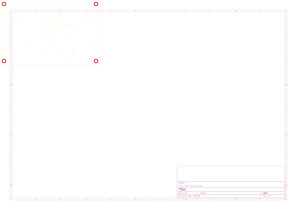
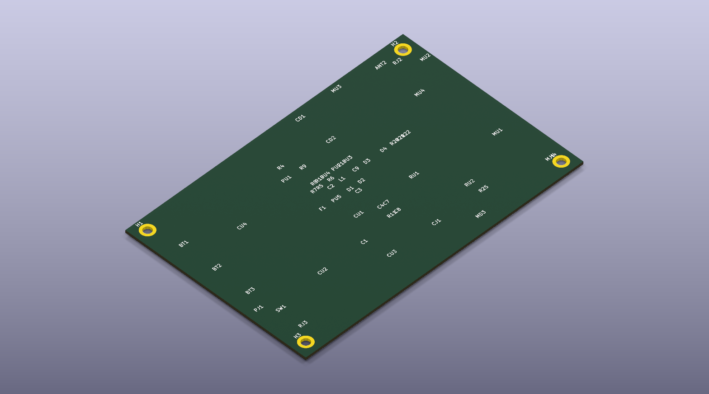
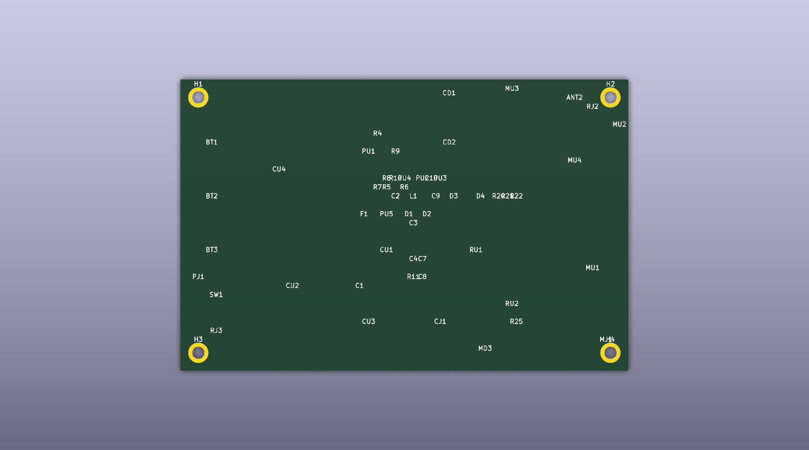

# wapiti hardware — generated KiCad + 3D-printable chassis

Everything in this directory is **generated from Python** (no hand-edited CAD), using the same
approach as the `luggage-tracker` LT-1: emitters write KiCad s-expressions with symbols embedded
inline (lib prefix `wapiti:`), custom footprints go to `wapiti.pretty/`, and `kicad-cli` validates
the results. Hardware stays reviewable in diffs and regenerable from the BOM in
[project-plan §4–5](../docs/project-plan.md).








## Artifacts

| Artifact | Produced by | What it is |
|---|---|---|
| `wapiti.kicad_sch` | `gen_schematic.py` | Root sheet with 4 child sheets (power / radio / cam / mcu) |
| `power.kicad_sch` | `gen_schematic.py` | BT1 smart 2S pack (Pack_Conn_5p: pack-ID + BQ27441 + thermistor), BT2 12×AA Li-FeS₂ tray, BT3 CR2032 anti-theft reserve, C1 5 F supercap ride-through (mitten swap), F1/F2 PTCs, D1/D3/D4 SS54 OR-ing, D2 TVS, J1 solar + U4 interlock (SOLAR_OK < 0 °C = PWR-08), U1 buck → V_SYS 3.8 V, U2/U3 load switches (EN_CAM/EN_MODEM from the C6), U5 gauge |
| `radio.kicad_sch` | `gen_schematic.py` | U1 EG915U LTE Cat-1bis + GNSS, U2 eSIM, J2 user-replaceable SMA (CAM-14), ANT2 GNSS patch under the lid RF membrane, J3 USB-C service |
| `cam.kicad_sch` | `gen_schematic.py` | U1 SSC377Q SoC, U2 IMX415 8.4 MP module, U3 eMMC + J1 microSD overflow, U4 2.0″ SPI LCD, D1/D2 IR arrays (940 nm no-glow / 850 nm low-glow) on Q1/Q2 low-side MOSFETs with 100 k gate pulldowns (dark through boot) |
| `mcu.kicad_sch` | `gen_schematic.py` | U1 ESP32-C6-WROOM-1 wake supervisor (owns the heartbeat HB-01..08), U2 LIS2DW12 (ACCEL_INT tamper wake), U3 AS312 PIR, U4 LD2410 radar (**value-SKU DNP candidate**), R25 + D3 status LED, SW1, J1 2×03 factory-programming header, J2 USB-C |
| `verify_schematic.py` | — | Union-find net verifier over the generated sheets (headless, no KiCad needed) |
| `wapiti.pretty/*.kicad_mod` | `gen_footprints.py` | 30 footprints (Pack_Conn_5p, EG915U, ESP32-C6-WROOM-1, SSC377Q_QFN, IMX415_Module, eMMC_153, microSD_Push, LCD_2in_FPC, IR_Array_30x10, PIR_Dome, Radar_LD2410, Diode_SMA for the SS54s, …) |
| `wapiti.kicad_pcb` | `gen_pcb.py` | 100 × 65 mm board, 58 placed footprints + 4 mounting holes, F.Cu zone, F.Fab front-panel-optics + antenna keep-outs |
| `wapiti.kicad_pro`, `fp-lib-table` | `gen_pcb.py` | Project file + footprint-lib registration via `${KIPRJMOD}` |
| `exports/` | `validate.sh` | `wapiti-pcb.svg`, per-sheet PDFs, `wapiti.step` (PCB 3D) |
| `exports/wapiti-pcb-3d-{top,iso}.png` | `kicad-cli pcb render` | PCB 3D screenshot, top + isometric (quality `high`) |
| `chassis/out/wapiti-{base,lid,tray}.{stl,obj}` | `chassis/gen_chassis_stl.py` | 3D-printable chassis + battery drawer; side-wall strap slots + lid ¼-20 boss (constructive geometry, no booleans) |
| `chassis/out/preview.svg`, `preview-plan.svg` | `chassis/gen_preview_svg.py` | Isometric (lid +45 z, drawer pulled −Y) and top-down interior previews |
| `chassis/gen_chassis.py` | — | Blender batch **renderer**: imports the verified STLs → `out/preview.png` (exploded), `out/preview-assembled.png`, `out/preview-top.png` |

## Regenerate

```bash
cd hardware
python3 gen_schematic.py       # 5 schematic files (root + power/radio/cam/mcu)
python3 verify_schematic.py    # -> "All schematic net checks passed"
python3 gen_footprints.py      # wapiti.pretty/ (30 footprints)
python3 gen_pcb.py             # wapiti.kicad_pcb + .kicad_pro + fp-lib-table
bash validate.sh               # kicad-cli export -> exports/  (needs KiCad AppImage)
# PCB 3D screenshot (KiCad 10):
kicad-cli pcb render --output exports/wapiti-pcb-3d-top.png --side top \
  --background opaque --quality high wapiti.kicad_pcb
kicad-cli pcb render --output exports/wapiti-pcb-3d-iso.png --rotate "-45,0,45" \
  --background opaque --quality high wapiti.kicad_pcb

cd chassis
python3 gen_chassis_stl.py     # out/wapiti-{base,lid,tray}.{stl,obj}
python3 gen_preview_svg.py     # out/preview.svg out/preview-plan.svg
~/Downloads/blender-5.2.0-linux-x64/blender -b -P gen_chassis.py   # out/preview*.png
```

Current status: schematic net verification passes; `validate.sh` was run and `exports/` contains
the SVG/PDF/STEP outputs; the chassis STLs parse cleanly (binary STL, exactly `84 + 50·n` bytes)
and Blender 5.2 rendered all three PNG previews headlessly on CPU (~10–15 s/frame; never call
`cycles.preferences.get_devices()` — GPU enumeration segfaults inside libsycl on this machine).

## Value SKU (wapiti-lite)

The Pro reference generated here populates everything. The cost-down is a two-line edit, then
regenerate: set `DNP_REFS = {("U4", "RADAR")}` in `gen_schematic.py` and `DNP_REFS = {"MU4"}` in
`gen_pcb.py` — the LD2410 mmWave radar drops off the BOM and its lid window keeps its 0.8 mm
membrane (weathering is unchanged).

## PCB ↔ chassis coordinate mapping

The chassis is **centered on the board**: PCB coordinates from `gen_pcb.py` are `0..100 × 0..65`,
chassis coordinates are `x = px − 50`, `y = py − 32.5`, with `z = 0` at the floor bottom.
Outer chassis: 108 × 74 × 33 mm (2 mm walls; the paddle lever stands 3 mm proud of the −Y face).
Board bottom sits at z = 19.5 on 17.5 mm bosses, above the battery drawer bay.

| Feature | PCB (px, py) | Chassis | Notes |
|---|---|---|---|
| Battery drawer bay | BT1/BT2/BT3 area | bay x −48..48, y −35..21, z 2..18.8 | 2S smart-pack insert; slides out the **−Y wall** on side rails |
| Paddle lever (§4.13) | — | full drawer width, y −40..−35.5, z 3..18.5 | One-motion pull; grip groove 8.5..12.5 z; hi-vis interior (renders orange) |
| Drawer rails / guides | — | rails x ±47..48 (z 2..3.2), guides z 12..18.8 | Lead-in steps at the mouth self-align the drawer (wedge) |
| USB-C service (RJ3) | (8, 60) | (−42, 27.5), cutout in **+Y** wall | 7.5 × 4.0 mm at z 21..25 |
| Button (SW1) | (8, 52) | (−42, 19.5) | Ø4.6 mm hole through the lid |
| Status LED (MD3) | (68, 64) | (18, 31.5) | Light pipe through the lid |
| IMX415 lens (CU2) | (25, 50) | (−25, 17.5) | Ø16 mm lid port + 3 mm seat boss |
| IR arrays (CD1/CD2) | (60, 7), (60, 18) | (10, −25.5), (10, −14.5) | Lid windows x −4..17 |
| PIR dome (MU3) | (74, 6) | (24, −26.5) | Ø11.5 mm hole |
| Radar patch (MU4) | (88, 22) | (38, −10.5) | Under the lid 0.8 mm membrane (DNP on lite) |
| SMA LTE antenna (RJ2) | (96, 6) | (46, −26.5) | Ø7 mm bulkhead through the lid — user-replaceable (CAM-14) |
| GNSS patch (ANT2) | (88, 8) | (38, −24.5) | Under the lid **0.8 mm RF membrane**, x 32..42 |
| PCB bosses / lid posts | holes (4/96, 4/61) | bosses (±46, ±28.5), posts (±49.5, ±34.5) | M2.5-class self-tap drills |
| Strap slots (tree webbing) | — | both ±X walls, y −11..11, z 22..25.5 | 22 × 3.5 mm slot, 2 in webbing; wraps the tree vertically, PQT-08 |
| ¼-20 tripod boss | — | lid (−30, 27), Ø13 mm, 4.5 mm tall | Standard camera-screw mount for tripod arms/brackets (§5.3) |

### RF window rationale

The lid carries a **0.8 mm plastic-only membrane** over the GNSS patch (x 32..42, y −29..−20) and
the radar window (x 28..48, y −20..−1), directly above ANT2 and the LD2410 patch. Any thicker a
dielectric stack — or a metal fastener over either antenna — costs dB exactly where the
Cat-1bis/GNSS link budget has none to spare. The lid infill is a 1.5 mm grid **with holes** (not a
solid plate) so it cannot act as a ground plane over the antennas; keep-outs are also marked on
F.Fab in `wapiti.kicad_pcb`.

### Mitten-swap wedge (§4.13)

The battery drawer is the one-motion swap: pull the full-width hi-vis paddle (3 mm proud, grip
groove at mitten height) and the drawer rides out on side rails with lead-in steps that
self-align reinsertion. The 5 F supercap on V_SYS keeps the C6 heartbeat and RTC alive through
the swap (PWR-07), and the pack's ID/thermistor pins on `Pack_Conn_5p` are read before the buck
re-enables. ≥20 mm clear grip geometry, no tools, gloved hands (HT-xx cases in the test plan).
The 12×AA Li-FeS₂ tray and Arctic LTO wedge are alternate inserts for the same rails.

### Tree mount (strap + ¼-20)

Two horizontal **strap slots** pierce both side walls (y −11..11, z 22..25.5 — above the drawer
bay, below the lid), sized for 2 in (50 mm-class) webbing straps: the strap wraps the tree
vertically through both slots, cinches flat against the back, and the slot lips carry the load
(no hook hardware). The paddle's under-flange doubles as a hang hook on the strap. On the lid, a
**1/4-20 UNC tripod boss** (Ø13 mm × 4.5 mm, printed solid with a Ø5 pilot to drill/tap, or a
heat-set brass nut) takes any standard camera bracket. Pull/torque evidence: **PQT-08** in the
test plan.

### Schematic net discipline (for future edits)

`gen_schematic.py` emits every wire endpoint from a pin tip via `tip()` helpers — never hand-typed
coordinates — and uses net labels at pin tips for nets crossing symbol bodies. After any change
run `python3 verify_schematic.py` (union-find over pin positions): it fails loudly on floating
pins, with `ALLOWED_NC` whitelisting the deliberate no-connects (eSIM VPP, USB CC/VBUS pins).
Cross-sheet nets (UART_RX/TX, EN_CAM, PERST, SOLAR_OK, …) are label-matched by name.
